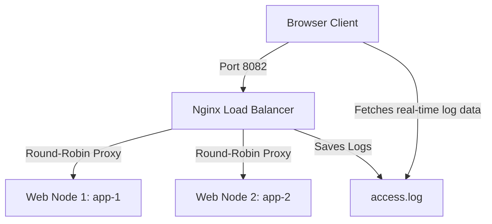

# NOC // Centralized DevOps & Security Observability Dashboard

A high-fidelity, slate-900 themed single-page DevOps and Security NOC Observability Dashboard built with **React (TypeScript)**, **Tailwind CSS v4**, **Lucide Icons**, and **Recharts**.

The application is deployed using a scaled **Docker Multi-Stage Build** and load-balanced using **Nginx (Round-Robin)**. It features real Nginx log integrations and automated CI/CD workflows.

---

## 🏛️ System Architecture



- **Nginx Load Balancer (Port 8082)**: Accepts incoming user connections, routes them dynamically using Round Robin, appends upstream routing header headers (`X-Upstream-Address`), and logs all operations.
- **Web Node 1 & 2 (Ports internal)**: Standalone Docker instances serving static React production assets.

---

## ⚡ Quick Start (Docker Compose)

Launch the entire load-balanced cluster (3 containers: 1 LB, 2 Web apps) with a single command:

```bash
# Build and run the cluster in background
docker compose up -d --build
```

Access the dashboard at: **[http://localhost:8082](http://localhost:8082)**

---

## 🛠️ Dashboard Interactive Simulations
- **Traffic Injection**: Use the **NORMAL (GET)** and **ATTACK (403 WAF)** buttons in the top right to generate live, network-level HTTP requests that bypass caches. Watch the TPS and WAF Block charts spike and observe Nginx log outputs in the terminal stream in real-time.
- **Node Failure & Recovery**: Click **SIMULATE CRASH** to flatline servers and force Kubernetes pods into `CrashLoopBackOff`. Click **REDEPLOY** to initiate the deployment rollback stabilization sequence.

---

## 🤖 CI/CD Automation (GitHub Actions)
The repository is integrated with GitHub Actions. On every push to the `main` or `master` branches, the pipeline:
1. Installs dependencies and verifies TypeScript and Tailwind compilation.
2. Compiles a production bundle.
3. Fires a POST webhook to Discord notifying team members of successful deployment.

*Make sure to configure your repository secrets with `DISCORD_WEBHOOK` key.*
